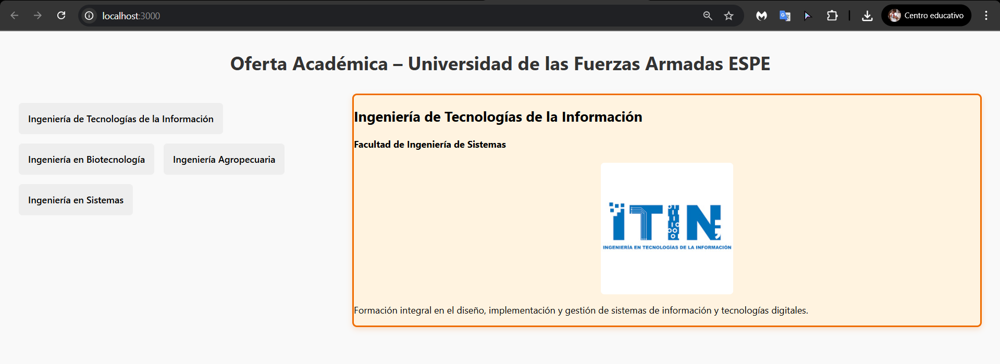
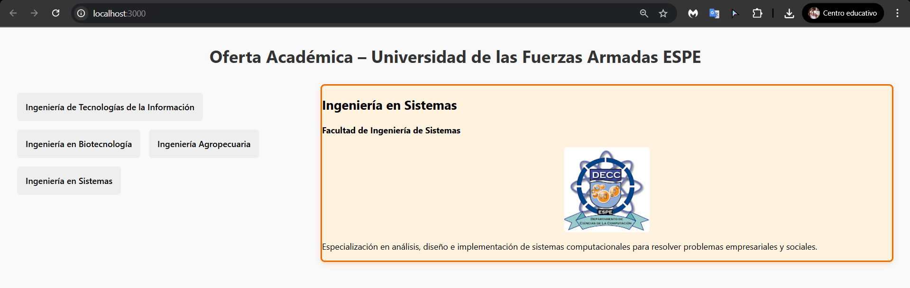

# Examen Integrativo Unidad 2 – ESPE

**Autor:** ANTHONY  
**Materia:** Aplicaciones Web  
**Institución:** Universidad de las Fuerzas Armadas ESPE  

---

## Descripción

Este proyecto presenta una interfaz interactiva desarrollada con **Web Components** utilizando el framework **Lit**. Simula la oferta académica de la Universidad ESPE y permite:

- Visualizar carreras disponibles
- Mostrar información dinámica de cada carrera
- Aplicar estilos temáticos según el último dígito de la cédula del estudiante

Cada carrera se muestra en una tarjeta personalizada con colores institucionales basados en el perfil académico.

---

## Instalar dependencias

```bash
npm install
```

## Ejecutar el proyecto

```bash
npm start
```

## Props utilizadas en **<career-card>**

| Propiedad     | Tipo   | Descripción                                                                 |
|---------------|--------|------------------------------------------------------------------------ ----|
| `name`        | String | Nombre de la carrera                                                        |
| `faculty`     | String | Facultad a la que pertenece                                                 |
| `description` | String | Breve descripción del programa                                              |
| `img`         | String | Nombre del archivo de imagen ubicado en la carpeta `/docs/`                 |
| `cedulaDigit` | String | Dígito final de la cédula para aplicar un tema visual personalizado         |

## Vista previa del proyecto

La imagen muestra el funcionamiento completo del sistema, con la carrera seleccionada, tarjeta visible e interacción activa.

Carrera ITIN



CARRERA SISTEMAS



## Estado del proyecto

✅ Funcionalidad completa
✅ Estructura modular y profesional 
✅ Diseño responsivo 
✅ Lista para entrega o publicación


